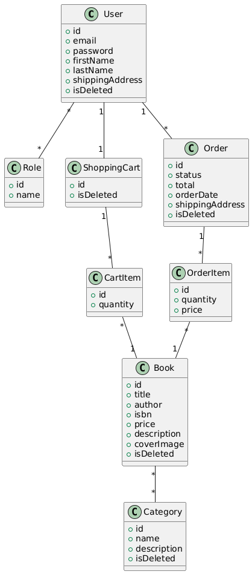

## Bookstore API

### ✏️ Intro
Welcome to Bookstore - my pet project that has been shaped by a simple desire to try out all learned technologies of Java ecosystem and have fun along the way.
The main technology behind the project is Java and Spring Boot. It has all the necessities of a modern day Web application, an online store in particular. Let me show you the details!
---
### 📡 Tech stack
- Java 17
- Spring Boot 3.4.3
- Spring Data JPA 3.4.3
- Spring Security 6.4.3
- MySql 8.0.33
- Docker 3.4.1
- JUnit 4.13.2
- Swagger 5.20.1
- Mapstruct 1.6.3
- AWS - EC2, ECR, RDS
---
### 🧨 Functionality
1. Registration, authentication and authorization:
   - Registration (`POST /auth/registration`) and login (`POST /auth/login`) flow
   - JWT token after successful login
   - Roles functionality (Admin and User(customer)).
   - The fields of both requests are validated By Hibernate validator!
2. Book creation, searching, update and deletion (CRUD):
   - As an admin user, I have permission to create(`POST /books`), update(`PUT /books/{id})`, delete(`DELETE /books/{id}`) books from the store.
   - As a customer/user, I am able to see all books(`GET /books`), perform parametrized search of books(`GET /search`), search by book id(`GET /books/{id}`).
3. Category creation, searching, update and deletion (CRUD):
   - Admin is able to perform CRUD operations with categories (`POST/GET /categories`, `PUT/DELETE /categories/{id}`).
   - User is able to retrieve categories by id(`GET /categories/{id}`), see all of them OR find all books that belong to a particular category, e.g. science fiction books(`GET /categories/{id}/books`).
4. User shopping cart is assigned to each user at the time of successful registration:
   - User is able to see his cart(`GET /cart`), add book items to it via book id and desired quantity(`POST /cart`).
   - Optionally, user may modify his cart item quantity by cart item id(`PUT /cart/items/{id}`) or delete it(`DELETE /cart/items/{id}`).
5. And lastly, order functionality:
   - User is able to see his orders (`GET /orders`),
   - Create a new order using a provided address and items in his shopping cart(`POST /orders`).
   - Retrieve info on a specific order by order id(`GET /orders/{orderId}/items`) OR info on specific order item by order id + order item id(`GET /orders/{orderId}/items/{orderItemId}`).
   - Admin is able to modify/update order status, e.g. "Order placed" -> "Processing"(`PUT /orders/{id}`).
---
### 🔬 UML Diagram

---
### 🔧 How to run and build the project locally
- Install:
    - Java 17 
    - Maven
    - MySQL
    - Docker
- Clone the repository
- Create an env file (a template is provided, see "env.template" file)
- Run the following commands:
```
mvn clean install
docker-compose build
docker compose up
```
- Launch Swagger locally via the 
```
http://localhost:8080/api/swagger-ui/index.html 
```
🔧 Note: currently N/A due to AWS free tier limit exceeding.
❗Alternatively, you can simply access the bookstore on the prod (yes, it is live on AWS!) here:
```
http://ec2-13-61-21-221.eu-north-1.compute.amazonaws.com/swagger-ui/index.html
```
---
### 🧪 [Postman collection for testing](https://.postman.co/workspace/My-Workspace~b74e25ab-645c-4949-88aa-7fad3466af15/collection/11850098-ea4bb625-0553-4d36-b45a-8efdce83d9fa?action=share&creator=11850098)
- Locally: just run the app as explained previously and send requests as they are.
- Prod: replace "http://localhost:8080" with "http://ec2-13-61-21-221.eu-north-1.compute.amazonaws.com" for a needed request and send it without extra hassle 🧠.
---
### ⚠️ Challenges faced
- Setup of Docker with existing MySQL DB running inside the container ✅
- Initial launch of Docker image on AWS EC2 instance ✅
- MapStruct configuration and mastering ✅
